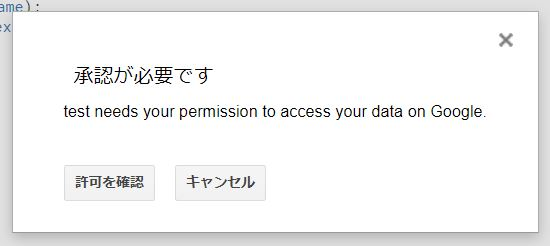
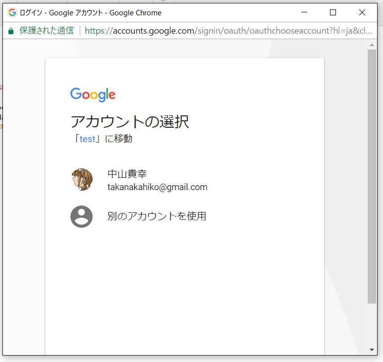
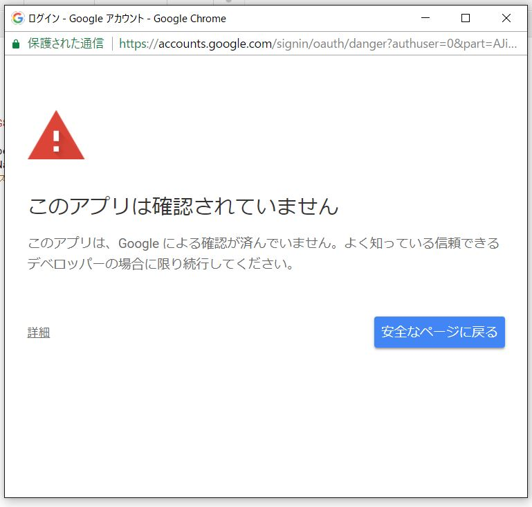
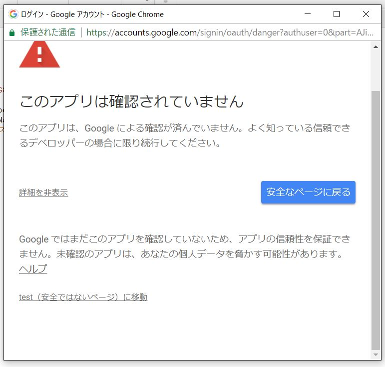
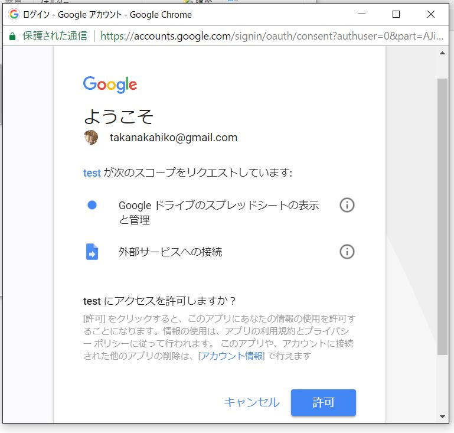

# 一部機能についての認証方法の変更について

## 経緯

スプレッドシート等の操作をする際の，実行前の認証画面が変更されました．

これは，セキュリティ強化のためで，不意にスプレッドシート等の操作を防ぐためだそうです．

## 認証方法

1. 認証前にこのような確認が表示されます．

2. 認証を行いたいアカウントを選択してください

3. ここが変更点です．左下の[詳細]をクリックしてください．

4. 左下の[〇〇に移動]をクリックしてください．

4. [許可]をクリックしてください．

以上で認証は完了です．